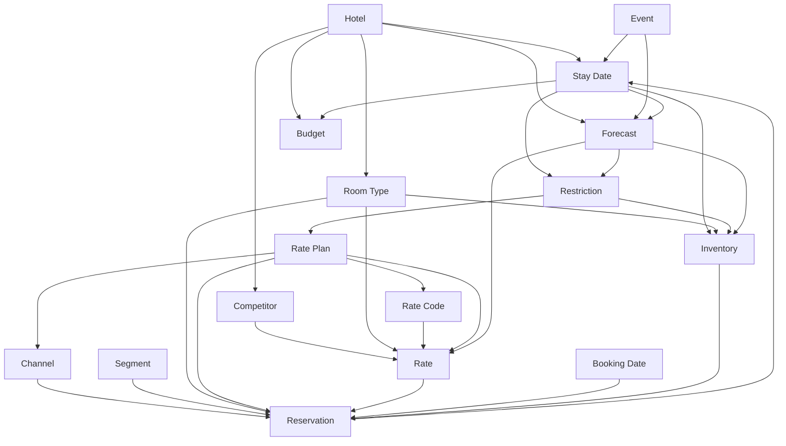

# Revenue Object Model

> 资产类型：对象模型（报表映射入口）
> 状态：Phase 1 初稿可用
> 日期：2026-08-20
> Last Verified：2026-08-20
> 对应任务：T4 / 任务书第二十九节
> 用法：用户丢来任何报表、截图、Excel 后，先把列和数字挂到对象上，再做诊断。挂不上的列标 Unknown，不要猜成「大概是入住率」。

---

## 0. 调用入口

顾问拿到一张表，按这个顺序贴标签：

1. **这张表的时间轴是什么？** Stay Date（入住夜）还是 Booking Date（预订发生日）还是 Snapshot Date（拍照日）？
2. **一单位是什么？** 间夜、订单、客人、营收、库存？
3. **每个数字属于哪个对象？** 先找 Hotel → Stay Date → Room Type → Rate/Rate Plan → Channel/Segment → Restriction/Inventory。
4. **谁和谁连？** 用第 18 节关系图，禁止把 Channel 当 Segment、把 Rate 当 Rate Plan。
5. **常见混淆先排除。** 每节末尾的「常见混淆」是必读，不是附录。

Phase 1 这些对象用于 **理解与建议**，不用于写操作系统字段。厂商字段名（OPERA Rate Code、CRS Rate Plan Code）只作映射线索。

证据：对象本身是业务结构（Internal + 行业实践）。能量化的属性优先用 STR/CoStar 官方定义（S）。Rate / Rate Code / Rate Plan 的分法来自 PMS/CRS/HTNG 文档（A，厂商口径，不是宇宙标准）。

---

## 1. 两个日期（先读，否则后面全错）

几乎所有误读都从这里开始。

| 日期 | 回答的问题 | 报表里常见列名 | 典型误用 |
| --- | --- | --- | --- |
| **Stay Date** | 客人住哪一晚？库存消耗在哪一晚？ | 入住日、在店日、营业日、Stay Date、Occupancy Date | 把「今天预订量」当成「今天入住表现」 |
| **Booking Date** | 这张预订哪天产生/改变？ | 预订日、下单日、Create Date | 用来算 OCC（错） |
| **Snapshot Date** | 这张 OTB 是哪天拍的？ | 数据日期、As-of、Extraction Date | 和 Stay Date 当同一天 |
| **Arrival Date** | 订单首晚 | 抵店日 | 多晚订单只算首晚库存（错） |
| **Departure Date** | 离店日（通常不当晚占用） | 离店日 | 把离店日算进 Stay Date（多数口径不算） |

**DTA（Days to Arrival / Days to Stay）** = Stay Date − Snapshot Date。Pace 必须在相同 DTA 上比。

**LOS** = 占用间夜数（通常 Departure − Arrival）。STR Glossary：LOS = number of nights a guest stays。

一笔 Reservation 在 Booking Date 创建，在多个 Stay Date 上各占 1 间夜 Inventory。

---

## 2. Hotel

### 定义
一家可独立经营、可独立出报表的住宿主体。STR 对 property 的排除标准（官方 Glossary，2026-08-20）：通常 ≥10 间、对公众开放、产生夜间收入。少于 10 间也可以参与；本库对单体酒店同样适用。

### 关键属性
- 名称 / 城市 / 商圈 / 位置类型（Urban、Suburban、Airport、Resort… STR Location Type）
- 档次：品牌 Chain Scale 或独立酒店 Class（Luxury → Economy）
- 总房量 Number of Rooms；是否 Full Service（STR：F&B 收入 > Total Revenue 的 5%）
- 经营类型：Chain Managed / Franchised / Independent
- 时区、币种
- Comp Set 指针（见 Competitor）
- 主要客群、定位（属性，不是 Segment 对象本身）

### 和谁相连
一对多：Room Type、Channel、Segment、Competitor（通过 Comp Set）、Event（市场级）、Budget、Forecast。  
所有 Reservation / Inventory / Rate 最终归到一个 Hotel。

### 用户报表怎么映射
- 表头「酒店名称 / 店号 / Property ID / STR ID」→ Hotel
- 只有城市没有店：先建一个临时 Hotel，属性标 Unknown
- 集团汇总表：先拆到 Hotel，再允许 Cluster 分析

### 常见混淆
- 一店多栋 / 公寓+酒店 共用库存，却按一个 Hotel 出 OCC → 标口径风险
- 把 Brand 当 Hotel（品牌不是库存主体）
- 用 Chain Scale 当质量判断（它首先按实际房价分组）

---

## 3. Stay Date

### 定义
客房被占用（或可被占用）的那个营业夜。库存、OCC、ADR、RevPAR、Restriction、绝大多数 Forecast 都以它为粒度。

### 关键属性
- 日历日、Day of Week、是否假期、是否肩日
- DTA（相对 Snapshot）
- 当日 Available / Sold / Remaining / OOO
- 当日 OTB、Pickup、Pace 指针
- 关联 Event

### 和谁相连
属于 Hotel。被多条 Reservation 的间夜击中。拥有当日 Inventory、Rate（价格点）、Restriction、Forecast、Budget 切片。被 Event / Competitor 价格所影响。

### 用户报表怎么映射
- 「10/3 入住、OCC、当日 BAR」→ Stay Date 10-03
- 周表 / 月表 = Stay Date 聚合，诊断时尽量拆回日
- Pickup 表的「目标日」是 Stay Date，「从哪天到哪天」是 Snapshot 窗口

### 常见混淆
- 把 Booking Date 的产量当 Stay Date 表现
- 用到店日代替每一间夜（3 晚订单只出现在 Arrival Date）
- 跨零点、凌晨房、钟点房：未声明时标 Unknown，不要强行进过夜口径

---

## 4. Booking Date

### 定义
预订被创建或发生净变化的日期。用于 Lead Time、预订生产、渠道投放效果，**不是**库存消耗日。

### 关键属性
- 创建日、最后修改日、取消日
- Lead Time = Stay Date（或 Arrival）− Booking Date
- 当日生产的间夜 / 营收（生产报表）

### 和谁相连
Reservation 的生命周期事件落在 Booking Date（及后续 modify/cancel 日）。与 Channel 投放、Event 官宣日经常对齐。与 Stay Date 通过 Reservation 相连。

### 用户报表怎么映射
- 「今日预订 80 间」若无 Stay Date 分布 → 这是 Booking Date 生产，不能直接说今天 OCC
- 取消报表的事件日是 Booking Date 类时间，取消影响的是未来 Stay Date 的 OTB

### 常见混淆
- 生产报表和在店报表一张图叠在一起
- Lead Time 用 Booking Date − 今天，而不是相对 Stay Date

---

## 5. Reservation

### 定义
一笔可确认的预订承诺：谁、住哪几晚、哪类房、什么价格规则、从哪来、是否可取消。OTB 是某 Snapshot 下未入住、未取消、未 No-show 的 Reservation 集合。

### 关键属性
- 确认号、状态（Confirmed / Cancelled / No-show / In-house / Checked-out）
- Arrival / Departure / LOS / 间数
- Room Type（预订房型 vs 实住房型）
- Rate Code / Rate Plan / 每晚 Rate
- Channel、Segment、是否 Group Block
- 担保、取消政策、已付、佣金标记
- 创建 Snapshot 与当前 Snapshot

### 和谁相连
属于 Hotel。拆成多条 Stay Date 间夜。引用 Room Type、Rate/Rate Code/Rate Plan、Channel、Segment。可能受 Restriction 约束才被接受。Group 订单还连 Block。

### 用户报表怎么映射
- 订单明细 / 在店名单 / 取消清单 → Reservation
- 只有「间夜数」没有订单号 → 先当聚合，不要虚构 Reservation
- 团队 Block 未分房：是库存占用，不一定已有客人级 Reservation

### 常见混淆
- 一单多间 vs 多单（Pickup +12 是 12 间夜还是 12 单）
- 预订房型 ≠ 实住房型（升级会扭曲房型 ADR）
- 已取消仍留在某张「历史生产」表里，被当成 OTB
- **口头拒客 ≠ Reservation。** 「赶过人」没有确认号就不是订单，也不是 Demand。要记成 Lost Request 至少要 Stay Date / 件数 / 房型 / 原因。不编中国 PMS 字段名。见 `../metrics/denials-regrets.md`

---

## 6. Room Type

### 定义
可独立定价、独立控库存的产品等级（或可售单位集合）。不是物理房间号。

### 关键属性
- 代码 / 名称（Base、Deluxe、Suite…）
- 物理库存数、可超售规则
- 是否可升级、是否共享库存（virtual / guaranteed）
- 与 BAR 的价差规则（绝对额或百分比）

### 和谁相连
属于 Hotel。被 Reservation 选中。有自己的 Inventory 与 Rate。Restriction 可按房型设。Forecast 常按房型拆。

### 用户报表怎么映射
- 「大床 / 双床 / 套房」列 → Room Type
- 只有房号：先归到房型，再分析
- 包栋、连通房：可能是组合产品，不要当标准 Room Type

### 常见混淆
- 房型代码在 PMS 与 OTA 不一致
- 把「景观房」当独立库存，实际是虚拟房型吃标准间库存
- 只管理最低价房型，忽略压缩与倒挂

---

## 7. Rate

### 定义
**某一 Stay Date、某一 Room Type、某一可售规则下的价格点**（每间夜金额）。是数字，不是产品。IHG HOLIDEX 公开术语：Rate = 向客人展示的、按使用计的金额（厂商 A，作对照）。

### 关键属性
- 金额、币种、含税/净价、含早与否
- 生效 Stay Date、适用 Room Type
- 来源：BAR 阶梯、协议价、促销价、包价
- 与竞对 Rate 是否可比（取消政策、餐食必须对齐）

### 和谁相连
由 Rate Plan / Rate Code 在某日「算出来」或「加载出来」。被 Reservation 落成成交价。影响 ADR。被 Pricing 决策直接改。

### 用户报表怎么映射
- 「今天 BAR 899」「成交均价 820」→ Rate（前者是报价，后者是 ADR 聚合）
- 竞对截图上的数字 → Competitor 的 Rate，不是自己的 Rate Plan

### 常见混淆
- 把 ADR 当 Rate（ADR 是已售房的平均结果）
- 把含早价和裸房价横比
- 认为改 Rate 等于改了所有渠道的 Rate Plan 规则

---

## 8. Rate Code

### 定义
PMS/CRS 里标识一条价格定义的 **代码**。OPERA 文档：Rate codes define prices for each room type over a date range or season；header 管售卖期，detail 管各房型价格（Oracle Help，厂商 A）。IHG：Rate Code 关联价格、库存、税、加床、是否可 yield。

### 关键属性
- 代码（RACK、BAR、CORP1、WKND…）
- 售卖窗（booking dates）vs 入住窗（stay dates）
- 房型价表、加床、包价元素
- 市场码 / 统计码默认值
- 是否可被 RMS yield / 关闭

### 和谁相连
属于 Hotel 的价格主数据。一个 Rate Code 在不同 Stay Date / Room Type 上产生不同 Rate。常 1:1 或 1:N 映射到对外 Rate Plan。Reservation 必须落一个码（在用 PMS 的酒店）。

### 用户报表怎么映射
- 列名「房价码 / Rate Code / 价格代码」→ Rate Code
- 「RACK 1200」可能是码的名称 + 某日 Rate，先拆开

### 常见混淆
- Rate Code = Rate Plan（对外渠道经常只说 Rate Plan，店内只有 Code）
- 一个码既是会员价又是协议价（主数据脏）
- 用 Rate Code 当 Segment（市场码才接近 Segment）

---

## 9. Rate Plan

### 定义
对外可售的 **产品规则包**：价格怎么来、谁能买、取消与预付、是否含早、占哪路库存。IHG 公开定义：Rate Plan = combination of inventory, price, and the rules that may affect price, access, and availability。HTNG：rate_plan_code 在 CRS/OTA 使用，名称可本地化。

### 关键属性
- 对外名称（含早预付、会员、协议、套餐）
- 资格围栏（会员、企业码、提前 N 天）
- 支付与取消
- 派生方式（BAR−10%、固定价）
- 渠道可见性

### 和谁相连
挂到 Channel 上出售。内部常映射一个或多个 Rate Code。受 Restriction 约束。是 Segmentation 的弱代理（不精确）。

### 用户报表怎么映射
- OTA 后台「产品 / 售卖房型 / Rate Plan」→ Rate Plan
- 「关低价」动作对象通常是 Rate Plan，不是改 BAR 数字本身
- 截图只有产品名：建 Rate Plan，Rate Code 标 Unknown

### 常见混淆
- 中国 OTA「售卖房型」= Room Type + Rate Plan 的混合物
- BAR 是 Rate Plan 还是 Rate？**BAR 是公开非限定最低价的定价锚，常表现为一组 Rate Plan / 一组 BAR 阶梯码**
- 会员价和 BAR 价差被当成 Segment 策略，实际只是围栏

### BAR 在本模型中的位置
BAR（Best Available Rate）不是独立第 17 个对象。它是 **公开、非限定资格的参考价格**，落在 Rate 上，通常由一组 Rate Code/Plan 承载。与 Rack（静态门市上限）区分。证据级 B/A（行业实践 + 厂商；STR Glossary 未把 BAR 收为主词条）。

---

## 10. Inventory

### 定义
某 Hotel 在某 Stay Date（常再拆 Room Type / Channel）上 **可卖的容量及控制结果**。STR 的 Rooms Available = 房间数 × 天数（官方）。顾问还要区分：物理房量、维修/停用、可超售上限、渠道配额、已被 OTB 占用后的剩余。

### 关键属性
- Physical / Available / OOO / Remaining
- Booking Limit / Sell Limit / Nested 结构
- Channel allocation
- Overbooking 上限
- 是否 Closed

### 和谁相连
按 Stay Date × Room Type 存在。被 Reservation 消耗。被 Restriction 有效缩小。Channel 可能看到不同剩余。Forecast 的容量约束来自这里。

### 用户报表怎么映射
- 「可售 / 剩余 / 已售 / 关房」→ Inventory
- 「剩余 12」先问：物理剩余、可超售后剩余、还是某渠道配额
- 满房但 BAR 还开着：可能是渠道不同步，不是需求信号

### 常见混淆
- Available 含不含 OOO、含不含 Complimentary 占房
- STR Demand/Rooms Sold **不含 Complimentary**（官方），与 PMS 在店数可能不一致
- Channel 关房被当成整店关房

---

## 11. Channel

### 定义
需求到达并完成交易的分销路径。不是客群。

### 关键属性
- 类型：Brand.com、Direct、GDS、OTA、Wholesale、Corporate portal
- 中国常见：携程、美团、飞猪、同程；国际：Booking、Agoda、Expedia
- 成本模型：Agency / Merchant / 广告
- 库存模式：分配 / 全量同步
- Parity 义务

### 和谁相连
出售 Rate Plan。消耗或预留 Inventory。Reservation 带 Channel。成本进入 Net Revenue（T12）。常被误标成 Segment。

### 用户报表怎么映射
- 「来源 / 渠道 / Market Source / OTA 名称」→ Channel
- 「携程预付」= Channel + Rate Plan，不是 Segment
- GDS 产出发票公司名，需要再映射真正 Channel

### 常见混淆
- Channel = Segment（OTA 上可以有商务散客和休闲）
- 只比 Gross ADR，忽略佣金
- 官网和会员渠道被算进 OTA

---

## 12. Segment

### 定义
按 **需求性质 / 购买原因 / 合同形态** 分的客人类型，用于 mix 与 displacement。STR 官方三分法：Transient（<10 间/晚）、Group（通常 ≥10 且有协议）、Contract（>30 天保底，如机组）。经营上会再拆 Retail、Corporate、Wholesale、Member 等。

### 关键属性
- 统计码 / 市场码（PMS）
- 典型 Lead Time、LOS、取消率、ADR
- 是否可被 yield
- 是否占 Block

### 和谁相连
Reservation 带一个（有时错误地带多个）Segment。Group Segment 连 Group 评估。与 Channel 多对多。Budget / Forecast 常按 Segment 拆。

### 用户报表怎么映射
- 「散客 / 团队 / 协议 / 门市 / 会员」→ Segment
- STR 报表只有 Transient/Group/Contract → 不要自动拆成 Retail/Corporate
- 市场码是免费早餐套餐：这是 Rate Plan 被错当成 Segment

### 常见混淆
- 用渠道当客群
- 团队散客化（9 间协议，STR 会进 Transient）
- Pickup 不按 Segment 拆，导致一个团队制造「市场很热」的假象

---

## 13. Restriction

### 定义
对 **谁能在哪个 Stay Date 以哪种 Stay Pattern / Rate Plan 买到房** 的约束。不是价格本身。常见：MinLOS、MaxLOS、CTA、CTD、Advance Purchase、Closed。HSMAI 2020：在需求超过供给且存在多晚需求时，限制才用于最大化跨日收入。

### 关键属性
- 类型、作用对象（整店 / 房型 / Rate Plan / Channel）
- 生效 Stay Date 区间
- 是否只作用于抵达日（CTA）或离店日（CTD）
- 与 hurdle/bid price 的关系（系统生成 vs 人工）

### 和谁相连
作用于 Stay Date ×（Room Type）×（Rate Plan）×（Channel）。改变有效 Inventory。影响 Reservation 能否生成。是 LOS Optimization 的操作手柄。

### 用户报表怎么映射
- 「连住 2 晚 / 不可入住 / 不可退房 / 提前 3 天」→ Restriction
- 渠道显示「最少住 2 晚」但 PMS 无限制：同步问题，先当 Unknown
- 关低价产品：可能是 Restriction（Closed to a plan）也可能是 Inventory Close，要拆

### 常见混淆
- 用 MinLOS 当涨价（有时有效，但是不同杠杆）
- 淡季留着高峰限制
- CTA 和 Closed 不分（一个是不能这天到，一个是这天不能卖）

---

## 14. Forecast

### 定义
对未来 Stay Date（常再拆房型 / 客群）的 **期望结果**：需求、OCC、ADR、Revenue，应带不确定性。它是判断，不是目标。

### 关键属性
- 颗粒度：Stay Date × Room Type × Segment × LOS（能到哪算哪）
- Constrained vs Unconstrained
- 版本与 Snapshot、谁 override
- 误差带（High/Base/Low）
- 来源：RMS / 人工 / Budget 团队（必须标明）

### 和谁相连
基于 OTB（Reservation 聚合）+ Pickup 历史 + Event + 市场。受 Inventory 容量约束。预算 Budget 是对照物。定价与库存决策读 Forecast，但不能把 Forecast 写成已发生事实。

### 用户报表怎么映射
- 「预测 OCC / Forecast / 系统建议」→ Forecast
- 只有一个数、没有日期颗粒：当月度 Forecast，日决策 Confidence 下调
- RMS 建议价不是 Forecast，是 Recommendation（决策输出）

### 常见混淆
- Forecast = Budget（一个是预期，一个是目标）
- 用已满房的历史当无约束需求
- 把 OTB 直接叫 Forecast

---

## 15. Budget

### 定义
事先设定的 **经营目标**（通常按月/年，有的拆到日或 Segment）。用于对照，不用于描述当前需求。

### 关键属性
- 周期、币种
- OCC / ADR / RevPAR / Revenue 目标
- 是否含成本 / GOP
- 版本（董事会版 vs 滚动预测被误标为 Budget）

### 和谁相连
属于 Hotel。按 Stay Date 或月切片。与 Forecast、OTB、实际 Performance 三对照。Group 决策有时用「对预算的洞」施压——顾问要分开「目标压力」和「需求事实」。

### 用户报表怎么映射
- 「预算 / Budget / 计划」→ Budget
- 「差预算 20 万」不是 Pace behind 的同义词（Pace 应对 STLY/曲线/Forecast）

### 常见混淆
- 为追预算在需求差的日子无差别降价
- 滚动 Forecast 被财务叫 Budget

---

## 16. Competitor

### 定义
与主体争夺同一批需求、用于定价信号和 benchmarking 的其他酒店。一组 Competitor = Comp Set。STR：Comp Set 是与你竞争客源、用来对照表现的一组酒店。可有 Primary / Secondary / Aspirational。

### 关键属性
- 名称、房量、档位、距离、产品
- 当日公开 Rate（必须注明 Rate Plan 条件）
- 是否满房 / 是否上限制
- 在 Comp Set 中的角色

### 和谁相连
挂在 Hotel 的 Comp Set 上。Competitor Rate 对照自己的 Rate（不是 ADR）。市场指标 MPI/ARI/RGI 是 Hotel vs 聚合组，不是单店点对点（除非用户给了单店）。Event 往往同时打到 Comp Set。

### 用户报表怎么映射
- 房价监控截图、Rate Shop、STAR Comp Set → Competitor
- 「市场 OCC」不是 Competitor 对象，是市场聚合
- 3 个竞对价 999/1029/1099 → 三个 Competitor 的 Rate 样本，不是 Comp Set 官方 ADR

### 常见混淆
- 竞对价 = 自己该卖的价
- 用含早取消政策不同的价格横比
- Comp Set 里塞了不抢同一客群的奢华或经济型，RGI 会骗人
- 把 OTA 排序当 Comp Set

---

## 17. Event

### 定义
改变某组 Stay Date 需求曲线的外部事件：节假日、展会、演唱会、会议、体育、交通中断、极端天气、目的地突发热度。

### 关键属性
- 名称、地点、开始/结束、影响 Stay Date（含肩日）
- 铅期（官宣到入住）
- 强度与可靠性（官宣 / 售票 / 历史同类）
- 影响客群（团队、休闲、商务）

### 和谁相连
改变 Stay Date 的 Forecast 与 Pace 解释。影响 Competitor 行为。可能产生 Group。Demand Signal 知识挂在这里（`demand-signals/`）。

### 用户报表怎么映射
- 「有演唱会」「广交会」「春节」→ Event
- 只有「节假日」没有日期范围：先标肩日 Unknown
- 机票/高铁数据是信号，不是 Event 本身

### 常见混淆
- 城市有活动 ≠ 本商圈有需求（距离、客单价）
- 用去年同名活动当今年强度（场馆、周几、官宣时间都可能变）
- 涨价后 Pickup 好，归因全给自己，忽略同日 Event 官宣

---

## 18. 对象关系



读图口诀：

- **Hotel** 拥有容量和主数据。
- **Stay Date** 是经营原子；**Booking Date** 是生产原子。
- **Reservation** 把「谁在哪晚、用什么规则、从哪来」钉死。
- **Rate** 是数；**Rate Code** 是店内码；**Rate Plan** 是对外规则包。
- **Inventory** 是还能卖什么；**Restriction** 是允许怎么住。
- **Channel** 是路；**Segment** 是人/需求类型。
- **Forecast** 是预期；**Budget** 是目标。
- **Competitor / Event** 从外部打进来，不进库存账，但改解释。

---

## 19. 用户报表 → 对象 速查

| 用户丢来的东西 | 先贴的对象 | 立刻要问的缺口 |
| --- | --- | --- |
| 在店 OCC/ADR/RevPAR | Hotel + Stay Date + Inventory | 含不含免费房、是否营业日 |
| 「目前订了 68%」 | OTB = Reservation 聚合 on Stay Date | Snapshot Date、DTA、对照物 |
| 「过去 3 天 +12%」 | Pickup on Stay Date | 12% 是间夜还是营收；有没有团队 |
| 生产报表 / 今日订单 | Booking Date + Reservation | 这些单住哪几天 |
| BAR / 日历价表 | Rate + Rate Plan + Stay Date + Room Type | 含早？哪个渠道？ |
| 房价码列表 | Rate Code | 和 Rate Plan / 渠道的映射 |
| 渠道佣金表 | Channel + Rate Plan | Gross 还是 Net |
| 散客/团队拆分 | Segment | 是否 STR 三分法 |
| 连住/不可入住 | Restriction | 作用到整店还是某产品 |
| 剩余 40 间 | Inventory | 物理还是渠道配额 |
| 预测 / 预算对照 | Forecast vs Budget | 谁做的、颗粒度 |
| 竞对截图 | Competitor.Rate | 产品条件是否可比 |
| 「有演唱会」 | Event → Stay Date | 哪几晚、铅期、距离 |
| STAR / MPI ARI RGI | Hotel vs Comp Set 聚合 | Comp Set 名单 |

---

## 20. 决策落点（建议必须写回对象）

任务书要求建议具体。允许的落点只有这些组合：

```text
Stay Date
  × Room Type
  × Rate 或 Rate Plan（改价 / 开关低价）
  × Inventory（开/关/保护/配额）
  × Restriction（MinLOS / CTA / CTD / AP）
  × Channel（可选）
  × Segment / Group（可选，团队单）
```

禁止只写「建议优化库存」而不点对象。Forecast 和 Budget 不是动作对象；Competitor 和 Event 不是动作对象（它们是输入）。

---

## 21. 未决

| 项 | 状态 | 说明 |
| --- | --- | --- |
| BAR 是否升级为独立对象 | 观察 | 先作为 Rate 的角色，避免和 Rate Plan 再打一架 |
| 国内 PMS「价格方案 / 售卖产品」统一译名 | Need Verification | 按用户截图临近映射 |
| Block / Allotment / Wash | 待建子对象 | 先挂在 Reservation + Segment(Group) + Inventory |
| Snapshot Date | 未单列 16 对象 | 已在第 1 节强制使用，下版可升格 |
| Complimentary / House Use | 待建 | 影响 STR 口径的 Rooms Sold |
| 包价拆房费 | Unknown | Rate vs F&B 分摊无统一公开标准 |

对象新增规则：不插入已有 16 个名字；新概念先当属性或子类型，避免报表映射表爆炸。
